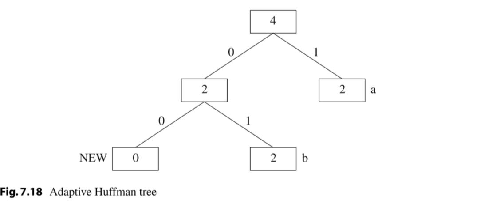
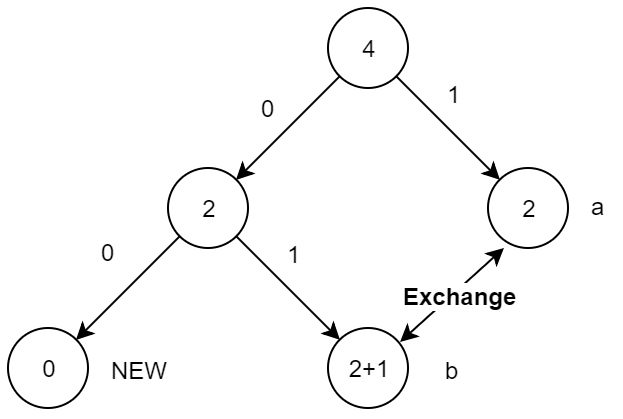
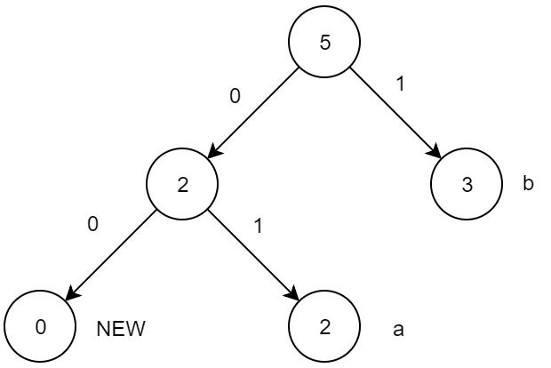
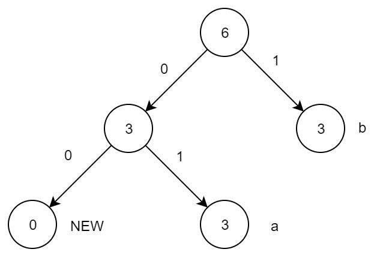
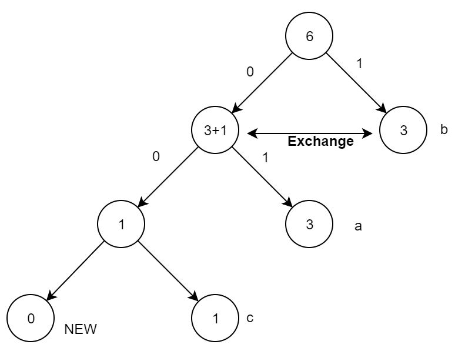
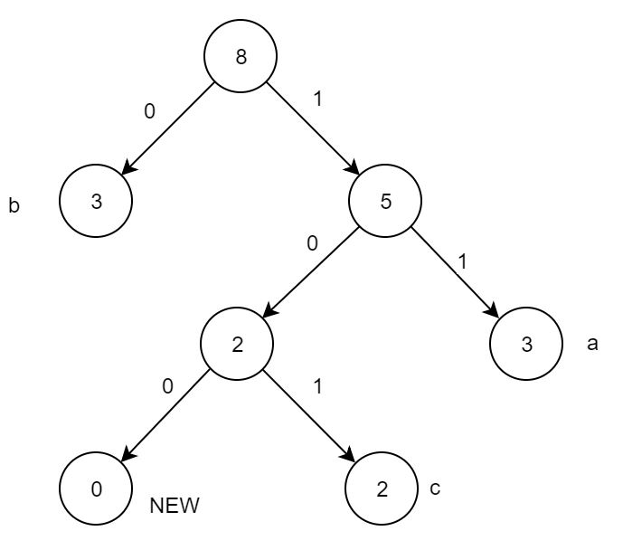

# 多媒体技术作业二

*学号：16340261 姓名：徐伟元 专业：软件工程*

## 第一题

### 题目描述

- **(a)** What are the advantages of Adaptive Huffman Coding compared to the original Huffman Coding algorithm?
- **(b)** Assume that Adaptive Huffman Coding is used to code an information source S with a vocabulary of four letters(a,b,c,d). Before any transmission, the initial coding is a = 00, b = 01, c = 10, d = 11. As in the example illustrated in Fig.7.8, as special symbol NEW will be sent before any letter if it is to be sent the first time.
  Figure 7.18 is the Adaptive Huffman tree after sending letters **aabb**. After that, the additional bitstream received by the decoder for the next few letters is 01010010101.

  

  - **i.**  What are the additional letters received?
  - **ii.** Draw the adaptive Huffman trees after each of the additional letters is received.

### 推导与作答

- **(a)** 原始的哈夫曼编码算法，是基于给定原始数据的，即算法是对**给定**的串(数据)，根据串中字符(基本元素)出现的频率，为频率高的字符分配短编码，反之分配长编码，从而使得可以用更短的编码传输串。
  但是，在大多数情况下，数据并不是给定的，而是不断变化的，在多媒体应用中更是如此。如实时通信，数据是动态更新的，甚至通信双方无法预测对方将会传输的数据。在这个时候，原始的哈夫曼编码算法将不足以完成压缩编码的作用，这也是原始哈夫曼编码算法的缺点。
  自适应哈夫曼编码算法，可以很好的解决这个问题，这也是它的优点：可以**动态地**完成数据编码压缩。自适应哈夫曼编码算法根据数据传送方发送的数据，动态的更新存储在本地的哈夫曼编码树，并且解析传送的编码。它不再基于给定数据，而可以在实时，动态数据中完成编码压缩。
- **(b)**
  - **i.** 接收到的新字符序列为：**bacc**

    解码器解码符号和对应编码序列如下：

    |Code|01|01|00|10|101|
    |----|-|--|--|--|--|
    |Symbol|b|a|NEW|c|c|
    
    *推导过程见下一问*
    
  - **ii.** 根据 Fig7.18 给出的哈夫曼树，可以得到编码表：

    |Code|1|01|10|11|00|
    |----|-|--|--|--|--|
    |Symbol|a|b|c|d|NEW|
  
    接收到的编码序列为 01010010101，根据编码表，可以得知，**01 对应字符 b**，所以更新哈夫曼树：

    
  
    发现此时树节点 b 的频率不满足从左到右，从上到下的升序关系，所以需要交换，与 a 节点交换，得到如下哈夫曼树：

    

    更新编码表：

    |Code|01|1|10|11|00|
    |----|-|--|--|--|--|
    |Symbol|a|b|c|d|NEW|
    
    剩余序列为 010010101，根据编码表，得到 **01 对应字符 a**，更新哈夫曼树：

    

    剩余序列为 0010101，根据编码表，**00 对应 NEW**，也就是说，下面要发送的是新字符，所以接收方不能够将序列解读为已接收过的字符，即后续序列 10101，根据编码表，**不能直接解读 1 为字符 b**，所以继续读入编码，发现 **10 对应 新字符 c**，所以更新哈夫曼树。在更新至 a 节点的父节点时，发现升序不满足，兄弟节点 b 的频率为 3，低于节点的频率 4，于是需要交换两个节点：

     

    得到哈夫曼树如上，更新编码表:

    |Code|11|0|101|11|100|
    |----|-|--|--|--|--|
    |Symbol|a|b|c|d|NEW|

    剩余序列为 101，根据编码表，**101 对应字符 c**，更新哈夫曼树：

    

    序列解读完毕，对应字符序列为 **bacc**

## 第二题

### 题目描述

You are given a computer cartoon picture and a photograph. If you have a choice of using either JPEG compression or GIF, which compression would you apply for these two images? Justify your answer.

### 算法设计与作答

- 方案选择
  
  对于卡通图片，我们选择 GIF，而照片，我们使用 JPEG。因为 JPEG 对于颜色

- JPEG 实现
